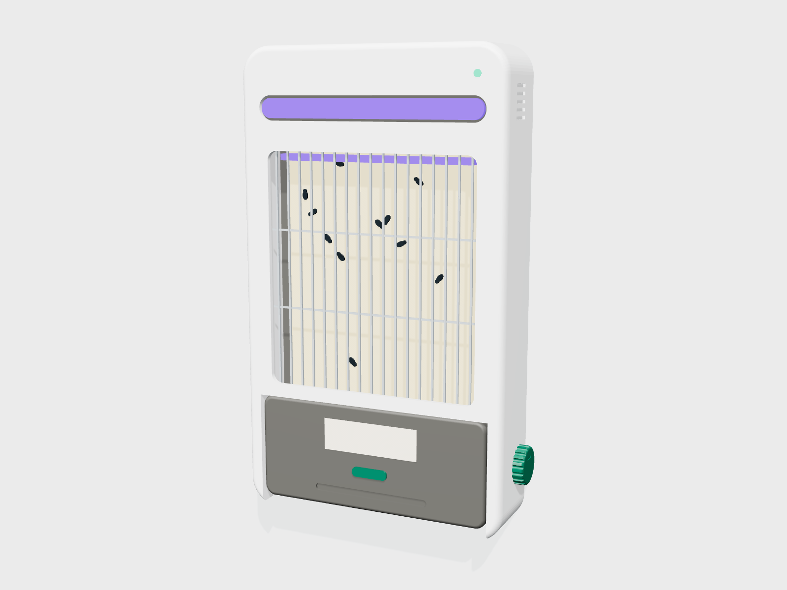
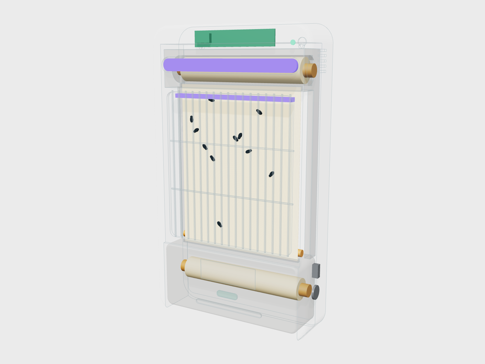
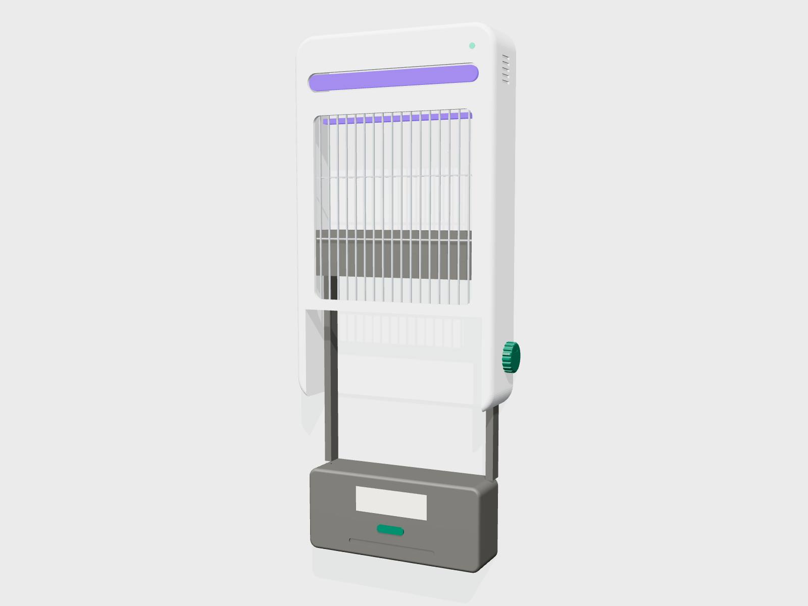
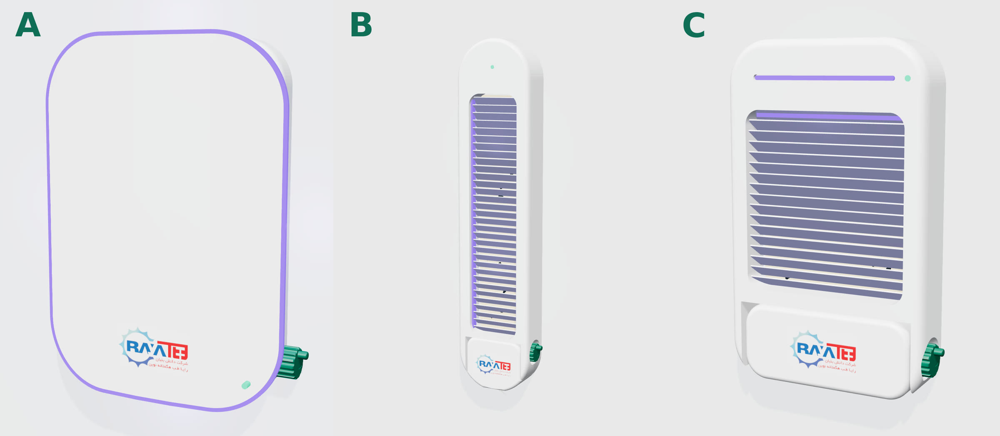
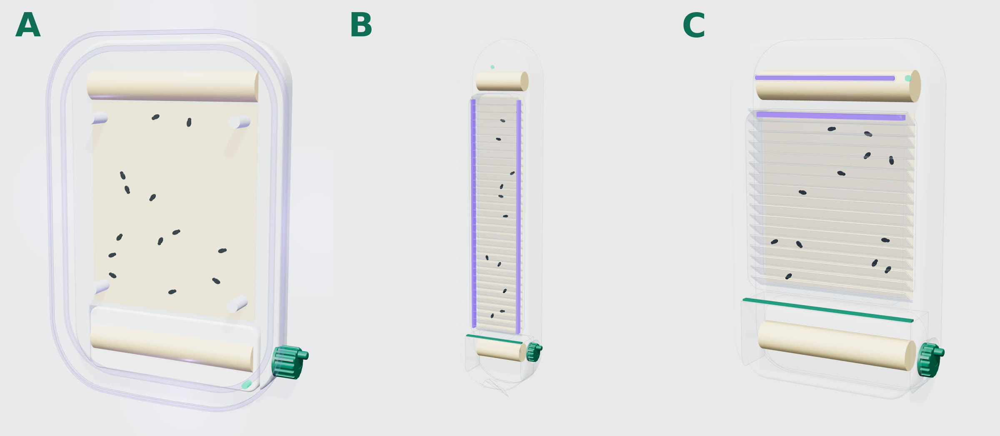
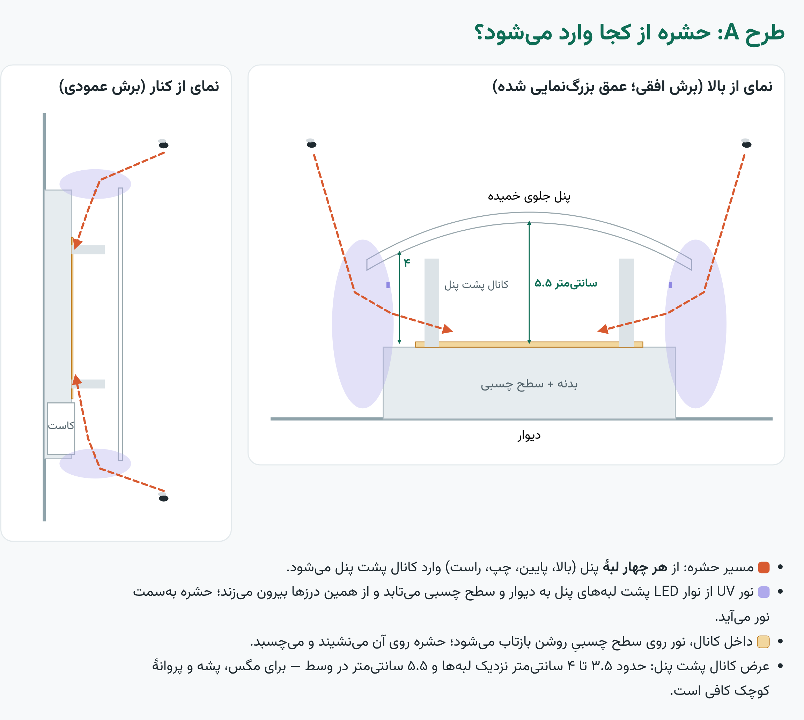
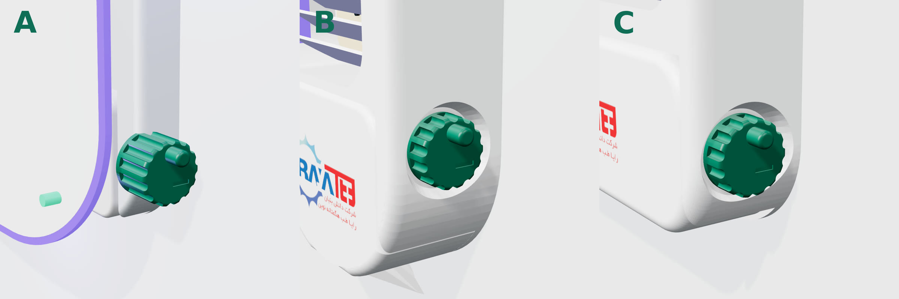

# طراحی تلهٔ حشرهٔ UV با فیلم چسبی رولی — نسخهٔ مفهومی ۰.۱

> وضعیت: طراحی مفهومی و مهندسی اولیه. همهٔ اعداد باید با نمونهٔ اولیهٔ واقعی آزموده شوند.
> مدل سه‌بعدی: `product/cad/trap.py` (خروجی STEP/STL در `product/cad/out/`) — محاسبات: `product/cad/calc.py`

---

## ۱. مشکل محصول فعلی (مدل مرجع بازار)

محصول مرجع یک بدنهٔ مثلثی است که لامپ UV بالای آن و **صفحهٔ چسبی تخت در کف** آن است.

| مشکل | علت |
|---|---|
| بوی بد | حشره‌ها روی صفحهٔ باز، در معرض هوا و نور UV، روزها می‌مانند و تجزیه می‌شوند |
| دیده شدن حشره‌ها | صفحه رو به بالا و کاملاً پیداست؛ برای بیمار و همراه ناخوشایند است |
| تماس هنگام تعویض | صفحهٔ پر از حشره با دست برداشته و دور ریخته می‌شود |
| افت کارایی | با پر شدن صفحه، سطح چسبی کم می‌شود و تا تعویض بعدی کارایی پایین است |
| لامپ فلورسنت UV | جیوه دارد، شکستنی است، مصرف بیشتر |
| ظاهر | بدنهٔ فلزی مثلثی، صنعتی و حجیم؛ مناسب فضای درمانی نیست |

## ۲. ایدهٔ اصلی

**سطح چسبی عمودی از یک رول فیلم تأمین می‌شود؛ قسمت استفاده‌شده به‌صورت خودکار (موتور) یا با چرخاندن دستگیره (دستی) داخل یک کاست دربسته پیچیده می‌شود.**

- لایه‌های فیلم کثیف روی هم پیچیده می‌شوند: سمت چسبی هر لایه روی پشت لایهٔ قبلی می‌چسبد ← حشره‌ها بین دو لایه **محبوس و بی‌هوا** می‌شوند ← بو تقریباً حذف می‌شود.
- سطح دیده‌شده همیشه تازه است ← کارایی ثابت.
- مصرف‌کننده فقط یک **کارتریج یکپارچه** را عوض می‌کند (رول نو + کاست جمع‌کننده + فیلم از قبل نخ‌کشی‌شده) ← هیچ تماسی با فیلم یا حشره نیست.
- کارتریج پر، دربسته، با برچسب «پلمب‌شده»، همراه پسماند عفونی جمع‌آوری و اتوکلاو/سوزانده می‌شود.

## ۳. مشخصات کلی

| مورد | مقدار پیشنهادی |
|---|---|
| ابعاد بدنه | ۳۴۰ × ۵۸۰ × ۹۰ میلی‌متر (عرض × ارتفاع × عمق) |
| نصب | دیواری (دو پیچ کلیدی)، ارتفاع پیشنهادی ۱.۵ تا ۲ متر |
| منبع نور | LED یووی-A حدود ۳۶۵ نانومتر، ۸ تا ۱۲ وات، دو ردیف (جلو برای جذب، داخلی برای روشن کردن سطح چسبی) |
| سطح چسبی دیده‌شده | حدود ۲۶۰ × ۳۲۰ میلی‌متر |
| فیلم | PET ۵۰ میکرون، پشت سیلیکونی ضدچسب، رو چسب حشرهٔ دائمی (پلی‌بوتن/هات‌ملت) با پایدارکنندهٔ UV — بدون لاینر |
| طول رول | ۱۰ متر (حدود ۳۱ بار پیشروی) |
| پوشش | اتاق تا حدود ۶۰ متر مربع (باید آزمون میدانی شود) |
| تغذیه | آداپتور خارجی ۲۴ ولت DC (SELV) — داخل دستگاه ولتاژ شبکه نیست |
| بدنه | ABS یا PC/ABS سفید ضد UV، قابل ضدعفونی با الکل/کلر رقیق |
| ایمنی | محافظ میله‌ای جلو (انگشت به فیلم نمی‌رسد)، نور LED مستقیم به چشم نمی‌تابد |

## ۴. اجزا (مطابق مدل سه‌بعدی)

1. **بدنه** — یک قطعهٔ تزریقی با پشت تخت، سر بالایی (LED و برد)، دو دیوارهٔ کناری و جای کارتریج که از پایین باز است.
2. **نوار LED جلو** — داخل شیار بالای بدنه، پشت پوشش PMMA مات (UV-عبور).
3. **نوار LED داخلی** — زیر لبهٔ بالای پنجره، رو به پایین؛ سطح چسبی را روشن می‌کند تا از دور دیده شود.
4. **محافظ میله‌ای** — ۱۷ میلهٔ عمودی + ۲ افقی، فاصله ۱۵ میلی‌متر.
5. **کارتریج یکپارچه** (مصرفی):
   - محفظهٔ رول نو در بالا (پشت LED، از جلو دیده نمی‌شود)
   - دو ریل کناری که فیلم بین آن‌ها کشیده می‌شود
   - **کاست جمع‌کننده** در پایین با شکاف ورودی باریک و نوار نمدی/برس، و دریچهٔ فنری که هنگام بیرون آمدن کارتریج شکاف را می‌بندد
   - برچسب «پلمب‌شده» و جای درج تاریخ و بخش
6. **غلتک اندازه‌گیر** بالای کاست — ۴ آهنربای کوچک + سنسور هال ← اندازه‌گیری دقیق طول پیشروی (هر پالس ≈ ۱۱ میلی‌متر).
7. **سیستم محرک** (یکی از دو نسخه):
   - **دستی:** دستگیرهٔ چرخشی Ø۴۸ کنار بدنه + جغجغهٔ یک‌طرفه (فقط یک جهت می‌چرخد) + چرخ‌دندهٔ ۱.۵:۱. علامت‌های چاپی لبهٔ فیلم در یک پنجرهٔ کوچک نشان می‌دهند کی پیشروی کامل شده («تا علامت بعدی بچرخانید») و چند متر فیلم مانده است.
   - **برقی:** موتور گیربکسی N20 (۱:۲۹۸) + چرخ‌دندهٔ ۱:۳ داخل دیوارهٔ کناری، کوپل به محور کاست با کوپلر شش‌گوش.
8. **برد الکترونیک** داخل سر دستگاه.

## ۵. محاسبات (خروجی `calc.py`)

| طول رول | قطر رول نو | قطر قرقرهٔ پر | تعداد پیشروی | دوام (هر ۳ روز) | دوام (هر ۷ روز) |
|---|---|---|---|---|---|
| ۵ متر | ۳۸ mm | ۴۴ mm | ۱۵ | ۱.۵ ماه | ۳.۵ ماه |
| **۱۰ متر** | **۴۸ mm** | **۵۶ mm** | **۳۱** | **۳ ماه** | **۷ ماه** |
| ۱۵ متر | ۵۶ mm | ۶۷ mm | ۴۶ | ۴.۶ ماه | ۱۰.۷ ماه |

- گشتاور لازم روی محور جمع‌کننده (فرض کشش ۲۰ نیوتن، رول پر): حدود **۰.۵۶ N·m (۵.۷ kg·cm)**
- موتور N20 ۱:۲۹۸ + ۱:۳ ← حدود ۱۰ kg·cm و ۳۳ دور در دقیقه ← هر پیشروی ۳ تا ۷ ثانیه
- نسخهٔ دستی: نیروی دست حدود ۱۶ نیوتن، ۳ تا ۶ دور دستگیره برای هر پیشروی

> ⚠️ عدد کشش ۲۰ نیوتن فرضی است. اولین آزمایش واقعی باید اندازه‌گیری نیروی جدا شدن فیلم از رول باشد (با نیروسنج فنری ساده).

## ۶. منطق کار نسخهٔ برقی

- **پیشروی خودکار** با یکی از این شرط‌ها (قابل تنظیم):
  - هر N ساعت (پیش‌فرض ۷۲ ساعت)
  - پر شدن سطح (نسخهٔ پیشرفته: دوربین کوچک یا سنسور نوری که لکه‌های تیره را می‌شمارد)
  - فشار دکمه توسط سرویس‌کار
- **پایان رول:** وقتی طول باقی‌مانده به یک پیشروی برسد، LED وضعیت نارنجی می‌شود. سرویس‌کار دکمه را نگه می‌دارد ← دستگاه **همهٔ فیلم باقی‌مانده را داخل کاست می‌پیچد**؛ انتهای فیلم از هستهٔ رول نو جدا می‌شود؛ پنجره خالی می‌شود و کارتریج بدون هیچ فیلم بیرونی خارج می‌شود.
- **ایمنی:** میکروسوییچ حضور کارتریج؛ اگر کارتریج نباشد موتور کار نمی‌کند. تشخیص گیر کردن فیلم (موتور می‌چرخد ولی انکودر پالس نمی‌دهد).
- **گزارش‌دهی (اختیاری):** وای‌فای؛ ارسال تعداد پیشروی، طول باقی‌مانده، زمان تعویض کارتریج و (در نسخهٔ دوربین‌دار) تعداد حشره به داشبورد کمیتهٔ کنترل عفونت.

## ۷. تعویض کارتریج (بدون تماس)

1. دکمه را نگه دارید تا باقی فیلم پیچیده شود (در نسخهٔ دستی: دستگیره را تا آخر بچرخانید).
2. ضامن سبز را فشار دهید؛ کارتریج کمی پایین می‌آید.
3. کارتریج را از دستگیرهٔ پایینی بیرون بکشید؛ دریچهٔ فنری شکاف کاست را می‌بندد.
4. کارتریج نو را از پایین جا بزنید تا کلیک کند.

زمان کل: کمتر از ۳۰ ثانیه، بدون تماس با فیلم.

## ۸. فهرست قطعات اولیه (نمونهٔ اولیه)

قیمت‌ها را عمداً ننوشته‌ام؛ باید از تأمین‌کننده‌های داخلی استعلام شود.

**بدنه و مکانیک**
- بدنهٔ ABS (نمونهٔ اولیه: پرینت سه‌بعدی PETG/ABS؛ تولید: قالب تزریق)
- پوشش PMMA مات UV-عبور برای LED جلو
- میله‌های محافظ (جزء قالب بدنه یا سیم فولادی ضدزنگ)
- دستگیره + جغجغهٔ یک‌طرفه یا کلاچ یک‌طرفه (برای نسخهٔ دستی)
- موتور گیربکسی N20 ۶ ولت ۱:۲۹۸ + یک جفت چرخ‌دندهٔ ۱:۳ (برای نسخهٔ برقی)
- کوپلر شش‌گوش، ۲ میکروسوییچ، فنر ضامن، پیچ‌ها

**کارتریج (مصرفی)**
- فریم PP تزریقی یا مقوای پوشش‌دار (ارزان و قابل سوزاندن)
- هستهٔ مقوایی Ø۲۵ × ۲ عدد
- رول فیلم چسبی ۲۶۰ میلی‌متر × ۱۰ متر
- نوار نمدی/برس شکاف، دریچهٔ فنری، برچسب

**الکترونیک**
- ماژول ESP32-C3 (کنترل، وای‌فای)
- درایور LED جریان ثابت (مثلاً مبتنی بر PT4115) از ۲۴ ولت
- LED یووی-A ۳۶۵ نانومتر روی PCB آلومینیومی (۲ نوار)
- درایور موتور DRV8833
- سنسور هال (مثلاً SS49E یا A3144) + ۴ آهنربای Ø۳
- مبدل ۲۴ به ۳.۳ ولت، LED وضعیت RGB، دکمه، بازر کوچک
- آداپتور ۲۴ ولت ۱ آمپر با تأییدیهٔ ایمنی

## ۹. تأمین فیلم چسبی — مهم‌ترین ریسک

| گزینه | توضیح |
|---|---|
| واردات رول آماده | تأمین‌کننده‌های خارجی رول فیلم چسبی مخصوص تله‌های رولی دارند؛ برای نمونهٔ اولیه سریع‌ترین راه است |
| تولید داخل | پوشش‌دهی چسب حشره روی PET پشت‌سیلیکونی در یک کارگاه پوشش‌دهی/لمینیت؛ برای تیراژ بالا ارزان‌تر است |

نکته‌های فنی:
- چسب باید **بدون لاینر** از پشت لایهٔ قبلی جدا شود (پشت سیلیکونی). در غیر این صورت به قرقرهٔ سوم برای جمع کردن لاینر نیاز است.
- چسب در دمای اتاق نباید بخزد و از لبه‌ها بیرون بزند.
- رنگ: سفید یا زرد روشن (UV را خوب بازتاب می‌کند).
- بدون حشره‌کش و بدون بو.

## ۱۰. استانداردها و مسائل حقوقی

- **ایمنی برقی:** IEC 60335-2-59 (حشره‌کش‌های برقی) و IEC 60335-1
- **ایمنی نوری:** IEC 62471 (گروه ریسک LED یووی)
- **سازگاری الکترومغناطیسی** برای محیط درمانی
- **پتنت (آزادی عمل / FTO):** سازوکار «فیلم چسبی رولی + کاست» در بعضی محصولات خارجی ثبت اختراع شده است. **قبل از تولید انبوه یا صادرات، حتماً یک کارشناس مالکیت فکری بررسی کند.** این طراحی از ایده‌های عمومی استفاده می‌کند و کپی هیچ محصول مشخصی نیست. در صورت تمایز کافی، ثبت اختراع داخلی هم ممکن است.

## ۱۱. مراحل پیشنهادی

1. **آزمایش فیلم** — تهیهٔ ۲ تا ۳ نوع رول، اندازه‌گیری نیروی جدا شدن، آزمون بو (۷ روز با حشره، مقایسه با صفحهٔ باز).
2. **نمونهٔ اولیهٔ مکانیکی (نسخهٔ دستی)** — پرینت سه‌بعدی از فایل‌های STL همین پوشه، تست پیچیدن و تعویض کارتریج.
3. **نسخهٔ برقی** — برد آزمایشی با ESP32-C3، موتور و انکودر؛ نوشتن فریم‌ور.
4. **آزمون میدانی** در یک بیمارستان (آشپزخانه و اورژانس)، مقایسه با محصول فعلی.
5. **طراحی برای تولید** — بهینه‌سازی برای قالب تزریق، تست‌های استاندارد، FTO.

## ۱۲. فایل‌ها

| فایل | توضیح |
|---|---|
| `cad/trap.py` | مدل پارامتریک CadQuery (همهٔ اندازه‌ها در دیکشنری `P`) |
| `cad/out/uv_roll_trap.step` | مدل کامل برای SolidWorks/Fusion/FreeCAD |
| `cad/out/*.stl` | قطعات جدا برای پرینت سه‌بعدی |
| `cad/calc.py` | محاسبات رول، گشتاور و انکودر |
| `render/` | رندر نماها با three.js (`node render.mjs`) |

---

## ۱۳. سه طرح ظاهری (نسخهٔ ۰.۲)

سازوکار هر سه یکی است (رول نو بالا، سطح چسبی عمودی، کاست دربستهٔ پایین)؛ فقط ظاهر و نحوهٔ پنهان کردن حشره‌ها فرق دارد.
مدل‌ها: `cad/concepts.py` ← `cad/out/concepts/<a|b|c>/` (STEP، STL) — رندر: `render/render-concepts.mjs`

| | A — چراغ دیواری | B — ستون باریک | C — طرح اصلاح‌شده |
|---|---|---|---|
| ابعاد (عرض × ارتفاع × عمق) | ۴۰ × ۵۶ × ۱۰ سانتی‌متر | ۲۰ × ۹۰ × ۸.۵ سانتی‌متر | ۳۴ × ۵۶ × ۸ سانتی‌متر |
| دیده شدن حشره‌ها | **اصلاً** (پشت پنل جلو) | تقریباً نه (پشت تیغه‌های مایل) | کم (پشت تیغه‌ها، از زاویه دیده می‌شود) |
| ظاهر | شبیه چراغ دیواری؛ شیک‌ترین | مدرن و باریک؛ مناسب راهرو و کنار در | آشناتر، صنعتی‌تر |
| جذب حشره | کمتر: نور UV فقط از لبه‌ها و از طریق بازتاب روی دیوار دیده می‌شود | خوب | خوب: نوار LED جلو مستقیم دیده می‌شود |
| سطح چسبی | بیشترین (۲۸ × ۳۲ سانتی‌متر) | کمترین (۱۲ × ۶۱ سانتی‌متر) | متوسط (۲۶ × ۲۹ سانتی‌متر) |
| تمیزکاری بدنه | ساده‌ترین (سطح صاف) | تیغه‌ها گرد و خاک می‌گیرند | تیغه‌ها گرد و خاک می‌گیرند |
| هزینهٔ قالب | متوسط (پنل خمیده) | بالاتر (بدنهٔ بلند) | کمترین |

**ورود حشره در طرح A:** از هر چهار لبهٔ پنل جلو وارد کانال پشت پنل می‌شود (عمق کانال حدود ۳.۵ تا ۵.۵ سانتی‌متر). نور UV از همین درزها بیرون می‌زند و حشره را به داخل می‌کشد.

**دستگیرهٔ دستی:** هر سه طرح دستگیرهٔ Ø۴۸ تا Ø۵۲ با شیار انگشت و دستهٔ کوچک چرخان دارند (سمت راست، هم‌محور با قرقرهٔ جمع‌کننده). در C و B گودی جای انگشت دور دستگیره هست؛ در A دستگیره زیر لبهٔ پنل است و از لبه بیرون می‌زند. در B قرقرهٔ جمع‌کننده کمی بالاتر رفته تا دستگیره روی بخش صاف بدنه باشد.

**پیشنهاد:** طرح **A** برای اتاق بیمار، لابی و فضاهایی که ظاهر مهم است؛ طرح **C** برای آشپزخانه و انبار که کارایی مهم‌تر است. هر دو می‌توانند یک کارتریج مشترک داشته باشند. مهم‌ترین آزمایش برای طرح A مقایسهٔ میزان جذب حشره با طرح C است، چون نور UV در طرح A غیرمستقیم است.
