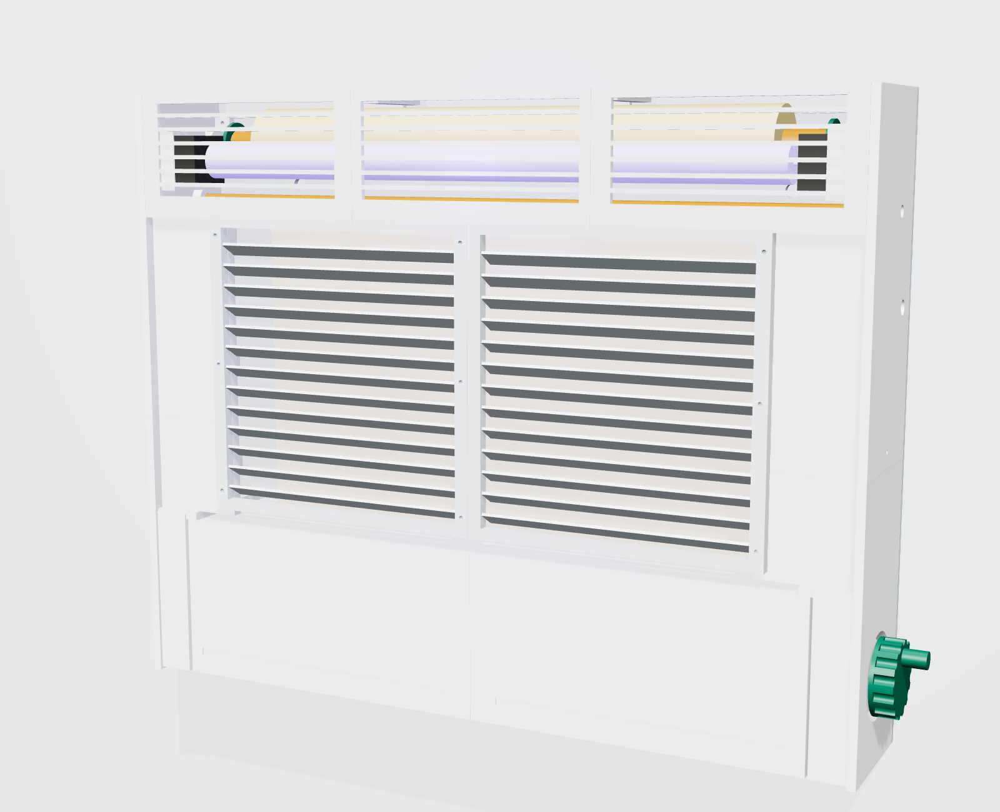
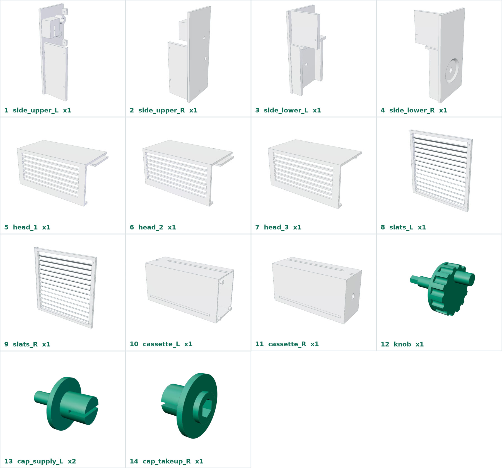
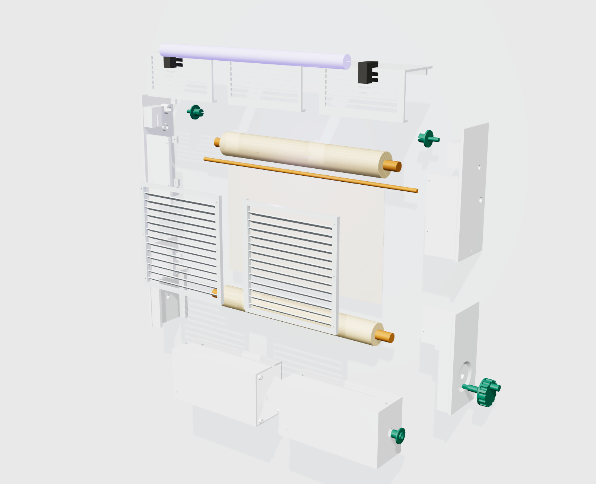

# RTH-C — نمونهٔ اولیه برای پرینت سه‌بعدی (نسخهٔ ۰.۱)

این نسخه فقط برای **ساخت نمونهٔ اولیه و آزمایش** است: سازوکار پیچیدن فیلم، جذب حشره و ابعاد. طراحی دور دو قطعهٔ خریدنی که در بازار ایران پیدا می‌شوند ساخته شده است:

| قطعهٔ اصلی | اندازه‌ای که طراحی بر اساس آن است |
|---|---|
| **لامپ حشره‌کش مهتابی T8 BL ۱۵ وات، پایهٔ G13** | طول با پین‌ها ۴۵۱.۶ میلی‌متر، قطر ۲۶ |
| **رول فیلم چسبی** | عرض ۴۰ سانتی‌متر، روی لولهٔ برق PVC ۲۰ میلی‌متری، بیشترین قطر رول نو ۶ سانتی‌متر (حدود ۱۰ متر) |

> اگر لامپ یا رول دیگری پیدا کردید، فقط عددش را بدهید؛ مدل پارامتریک است و همهٔ قطعات در چند ثانیه دوباره ساخته می‌شوند
> (لامپ‌های آماده در کد: `T8_15W`، `T8_18W` و `T5_8W`؛ عرض رول: `RTH_FILM_W`).

**ابعاد کلی دستگاه:** ۵۵ × ۴۴ × ۱۰ سانتی‌متر (عرض × ارتفاع × عمق) — **سطح چسبی دیده‌شده:** حدود ۴۰ × ۲۴ سانتی‌متر

---

## ۱. قطعات پرینتی (۱۶ عدد)

همهٔ قطعات در بستر **۲۵۰ × ۲۵۰ میلی‌متر** جا می‌شوند. فایل‌ها در پوشهٔ `stl/`.

| # | فایل | تعداد | ابعاد تقریبی (mm) | جهت پرینت |
|---|---|---|---|---|
| 1 | `side_upper_L.stl` | 1 | 240 × 95 × 64 | دیوارهٔ تخت روی بستر |
| 2 | `side_upper_R.stl` | 1 | 240 × 95 × 64 | دیوارهٔ تخت روی بستر |
| 3 | `side_lower_L.stl` | 1 | 200 × 95 × 64 | دیوارهٔ تخت روی بستر |
| 4 | `side_lower_R.stl` | 1 | 200 × 95 × 64 | دیوارهٔ تخت روی بستر |
| 5–7 | `head_1/2/3.stl` | هر کدام 1 | 190 × 95 × 90 | سقف روی بستر (شبکهٔ جلو عمودی) |
| 8–9 | `slats_L/R.stl` | هر کدام 1 | 228 × 212 × 17 | **روی صورت جلو**؛ تیغه‌ها ۳۰ درجه‌اند و ساپورت نمی‌خواهند |
| 10–11 | `cassette_L/R.stl` | هر کدام 1 | 248 × 120 × 89 | صورت جلو روی بستر |
| 12 | `knob.stl` | 1 | 74 × 52 × 52 | دستگیره روی بستر، محور رو به بالا |
| 13 | `cap_supply_L.stl` | **2** | 32 × 32 × 30 | فلنج روی بستر |
| — | `cap_takeup_L.stl` | 1 | 32 × 32 × 30 | فلنج روی بستر |
| 14 | `cap_takeup_R.stl` | 1 | 32 × 32 × 22 | فلنج روی بستر |

(`cap_supply_R.stl` همان `cap_supply_L` است؛ کافی است `cap_supply_L` را دو بار پرینت کنید.)

**تنظیمات پیشنهادی پرینت**

- جنس: **PETG** (نزدیک لامپ و بالاست گرم می‌شود و PLA ممکن است تاب بردارد؛ برای نور UV طولانی، ASA بهتر است)
- لایه ۰.۲ میلی‌متر، ۳ دیواره، پرشدگی ۲۰٪ (درپوش‌ها و دستگیره ۴۰٪)
- رنگ: سفید برای بدنه، سبز برای دستگیره و درپوش‌ها
- سوراخ‌های پیچ برای **پیچ خودکار M3** طراحی شده‌اند (قطر ۳.۲ تا ۳.۴)

## ۲. قطعات برشی

| قطعه | جنس | اندازه | فایل |
|---|---|---|---|
| صفحهٔ پشت | ورق PVC فوم (فورکس) ۵ میلی‌متری، یا پلکسی یا MDF | ۵۵۲ × ۴۴۰ | `dxf/back_plate_5mm.dxf` (لیزر/CNC یا دستی با شابلون) |
| هستهٔ رول نو | لولهٔ برق PVC ۲۰ میلی‌متری | **۴۶۰ میلی‌متر** | — |
| هستهٔ جمع‌کننده | لولهٔ برق PVC ۲۰ میلی‌متری | **۴۶۸ میلی‌متر** | — |
| میلهٔ راهنمای فیلم | میلهٔ استیل یا آلومینیوم Ø۸ | **۵۵۲ میلی‌متر** | — |

## ۳. خرید از بازار

| قطعه | تعداد | نام در بازار |
|---|---|---|
| لامپ UV حشره‌کش | 1 | «لامپ حشره‌کش ۱۵ وات T8 BL پایه G13» |
| سرپیچ لامپ | 2 | «سرپیچ مهتابی T8 (G13)» معمولی، پیچی |
| راه‌انداز لامپ | 1 | «ترانس الکترونیکی مهتابی» مخصوص ۱۵ وات T8 — یا «چوک ۱۵/۲۰ وات + استارتر» |
| کلید و سیم برق | 1 | کلید راکر کوچک + سیم دو رشته با دوشاخه + گلند کابل (سوراخ Ø۱۰ در دیوارهٔ راست) |
| آهنربای نئودیمیوم | 4 | دیسکی ۱۰ × ۳ میلی‌متر |
| اورینگ | 1 | قطر داخلی ۹، ضخامت ۲ (روی محور دستگیره؛ آن را در جای خودش نگه می‌دارد) |
| پیچ | حدود ۴۰ | پیچ خودکار M3 × ۱۲ (چند تا M3 × ۱۶) |
| فیلم چسبی | 1 رول | بخش ۵ را ببینید |

## ۴. مونتاژ

1. **صفحهٔ پشت** را از روی DXF ببرید و سوراخ‌ها را دربیاورید.
2. **دیواره‌های کناری** (بالا و پایین، چپ و راست) را به صفحهٔ پشت پیچ کنید و دو نیمهٔ هر طرف را در محل هم‌پوشانی با یک پیچ M3 به هم ببندید.
3. **سرپیچ‌های G13** را روی پدهای دیوارهٔ بالا ببندید. شیارها اجازه می‌دهند فاصله را ±۵ میلی‌متر تنظیم کنید تا لامپ سفت و درست جا بیفتد.
4. **بالاست** را روی صفحهٔ پشت، پشت سطح فیلم سمت چپ، ببندید و سیم‌کشی را **طبق نقشهٔ روی بالاست** انجام دهید (بخش ۶).
5. **میلهٔ راهنما** را از سوراخ دیواره‌ها رد کنید.
6. **رول نو:** دو `cap_supply` را در دو سر لولهٔ ۴۶۰ میلی‌متری فشار دهید. فیلم را طوری بپیچید که **سمت چسبی رو به بیرون** باشد. محورهای ۸ میلی‌متری را از جلو در شیارهای U شکل بالای دیواره‌ها بگذارید.
7. **مسیر فیلم:** از جلوی رول ← روی جلوی میلهٔ راهنما ← پایین ← از شکاف سقف کاست به داخل. سر فیلم را با چسب نواری به لولهٔ جمع‌کننده (با `cap_takeup_L` و `cap_takeup_R`) بچسبانید و دو نیمهٔ کاست را با ۳ پیچ ببندید.
8. **کاست** را از پایین بین دیواره‌ها بالا ببرید تا آهنرباها بچسبند. **دستگیره** را فشار دهید تا سر شش‌گوش در درپوش جا برود.
9. **لامپ** را جا بزنید. **سه تکهٔ سرپوش بالا** و **دو نیمهٔ پنل تیغه‌ای** را پیچ کنید.
10. داخل سرپوش بالا (پشت لامپ) را با **نوار چسب آلومینیومی** بپوشانید تا نور UV به‌سمت فیلم و بیرون بازتاب شود.
11. روی دیوار، با دو سوراخ کلیدی، در ارتفاع حدود ۱.۸ تا ۲ متر نصب کنید.

**کار با دستگاه:** دستگیره را در جهت فلش بچرخانید. هر بار پیشروی حدود ۳ تا ۶ دور است (هرچه قرقره پرتر شود، دور کمتری لازم است).
**بیرون آوردن کاست:** دستگیره را حدود ۱.۵ سانتی‌متر بیرون بکشید و کاست را پایین بکشید. در نمونهٔ اولیه، رول نو در سرپوش بالا جداست. برای تعویض کامل، اول همهٔ فیلم را داخل کاست بپیچید.

## ۵. فیلم چسبی برای نمونهٔ اولیه

رول آمادهٔ مخصوص این کار در بازار ایران پیدا نکردیم. برای آزمایش، این روش ساده جواب می‌دهد:

- **پایه:** رول **کاغذ روغنی (کاغذ شیرینی‌پزی سیلیکونی)**. دو طرفش ضدچسب است، پس وقتی پیچیده می‌شود، چسب هر لایه از پشت لایهٔ بعدی جدا می‌شود. این همان خاصیت «بدون لاینر» است که لازم داریم.
- **چسب:** **چسب حشره** یا **چسب تلهٔ موش** که در تیوب فروخته می‌شود، به‌صورت لایهٔ نازک و یکنواخت روی یک طرف (با کاردک پلاستیکی).
- **عرض:** طراحی برای ۴۰ سانتی‌متر است. اگر کاغذ ۳۰ یا ۴۵ سانتی‌متری پیدا کردید، عددش را بگویید تا قطعات را برای همان عرض بسازم.
- برای آزمایش اولیه ۲ تا ۳ متر کافی است.

## ۶. ایمنی برق (مهم)

- لامپ مهتابی با برق **۲۲۰ ولت** و بالاست کار می‌کند. **سیم‌کشی را حتماً برق‌کار انجام دهد.**
- بالاست را کامل بپوشانید و هیچ سیم بی‌روکشی نماند. جای گلند کابل و کلید در دیوارهٔ راست است.
- لامپ شیشه‌ای است. نمونهٔ اولیه را فقط در محیط آزمایش استفاده کنید. محصول نهایی برای بیمارستان باید لامپ نشکن (روکش‌دار) یا LED داشته باشد.
- به نور لامپ UV مستقیم و طولانی نگاه نکنید.

## ۷. آزمایش‌هایی که با نمونهٔ اولیه انجام می‌شود

1. **پیچیدن فیلم:** آیا فیلم صاف و بدون کج شدن پایین می‌آید؟ نیروی لازم برای چرخاندن دستگیره چقدر است؟
2. **جدا شدن از رول:** آیا لایه‌ها راحت از هم جدا می‌شوند و چسب کنده نمی‌شود؟
3. **جذب:** ۴۸ ساعت در آشپزخانه یا انبار؛ شمارش حشره‌ها.
4. **بو:** حشره‌های پیچیده‌شده در کاست بعد از ۷ روز در برابر صفحهٔ چسبی باز.
5. **گرما:** دمای بدنه نزدیک لامپ و بالاست بعد از ۸ ساعت روشن بودن.

نتیجهٔ این آزمایش‌ها را بفرستید تا نسخهٔ بعدی را اصلاح کنم.

## ۸. فایل‌ها

| مسیر | توضیح |
|---|---|
| `stl/` | فایل‌های پرینت |
| `dxf/back_plate_5mm.dxf` | برش صفحهٔ پشت |
| `step/RTH-C_proto_assembly.step` | مدل کامل مونتاژی (SolidWorks، Fusion، FreeCAD) |
| `cad/rth_c_proto.py` | مدل پارامتریک (CadQuery) — `python3 cad/rth_c_proto.py` |
| `dimensions.json` | ابعاد محاسبه‌شده |
| `images/` | تصاویر |
