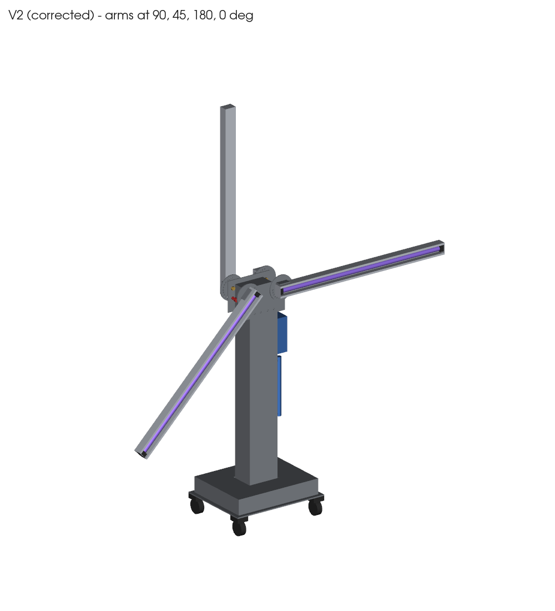
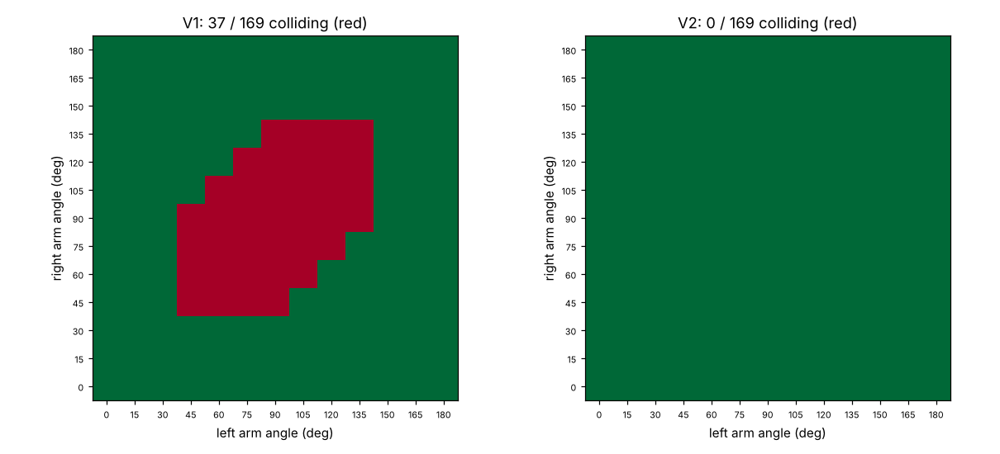
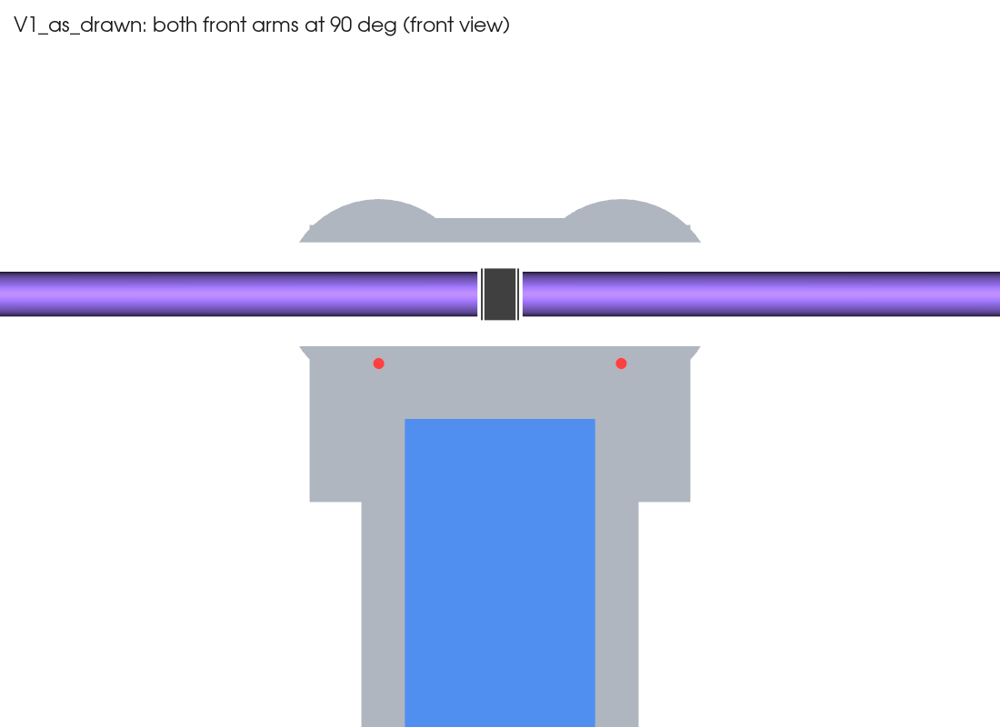
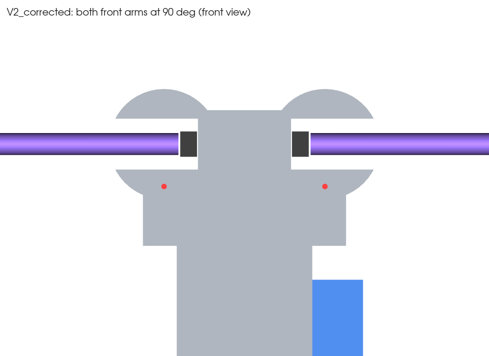
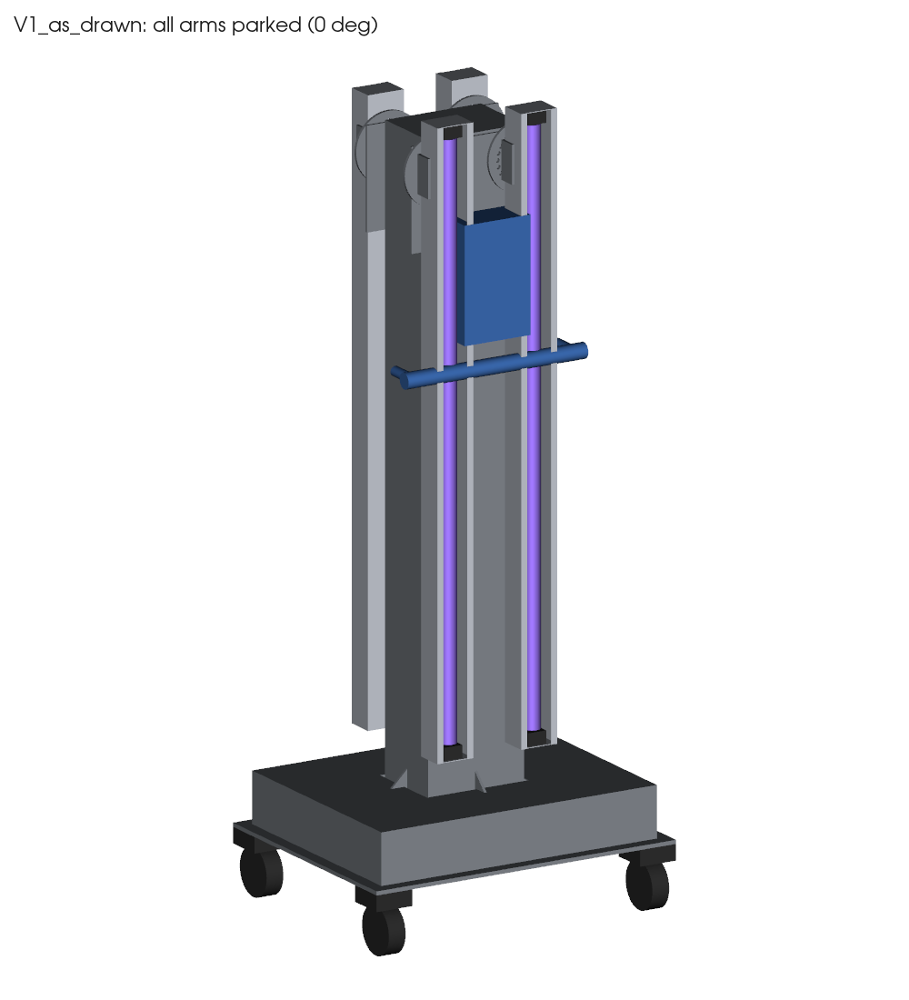
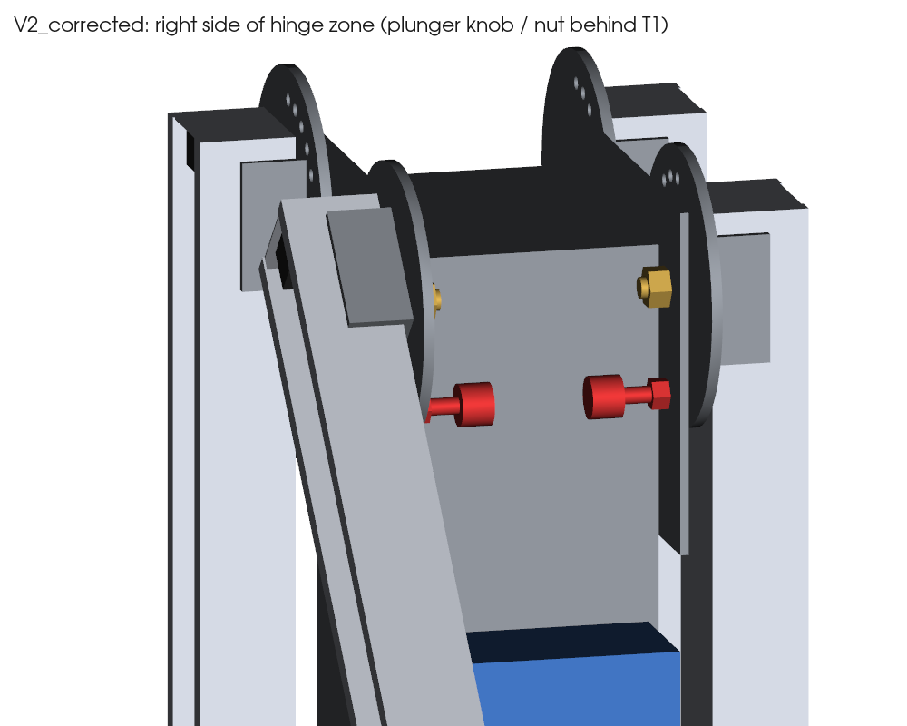

# پایه UV-C چهاربازو — مدل سه‌بعدی قطعات فلزی و بررسی مونتاژ

مبنا: «نقشه ساخت پایه UV-C چهاربازو ۳۰ وات» (۱۷ مهر ۱۴۰۵).
همه قطعات فلزی به‌صورت پارامتریک با **CadQuery** (هسته OpenCascade، همان نوع هسته‌ای که SolidWorks با فایل STEP می‌خواند) ساخته شدند. سپس مونتاژ به‌صورت خودکار بررسی شد: تداخل حجمی بین همه قطعات، در هر ۱۳ زاویه هر بازو (۰ تا ۱۸۰ درجه با گام ۱۵)، و هر ۱۶۹ ترکیب زاویه‌ای بازوی چپ و راست روی یک وجه.

دو نسخه وجود دارد:

| نسخه | توضیح | نتیجه |
|---|---|---|
| **V1** | دقیقاً طبق PDF | **۱۱ مورد رد** — مونتاژ نمی‌شود یا کار نمی‌کند |
| **V2** | با اصلاحات پیشنهادی (پایین) | **همه ۱۹ بررسی قبول** |



## پاسخ کوتاه

**نقشه فعلی (V1) را نمی‌شود همان‌طور ساخت و درست سر هم کرد.** ۵ مورد جدی است:

1. **پین فنری قفل (H4) قابل دسترسی نیست.** پین در ۴۰ میلی‌متری زیر محور لولا و روی T1 است (x=±70). دیسک جلوی T1 قرار دارد، پس دسته پین باید پشت T1 باشد. پشت T1 در این نقطه دیواره ستون است (لبه ستون x=±80). یعنی دسته داخل ستون می‌افتد.
2. **پیچ محور M10×60 جا نمی‌شود.** ضخامت کل قطعات روی محور ۱۵ میلی‌متر است. ۴۵ میلی‌متر اضافه می‌ماند. اگر سر پیچ داخل ناودانی باشد، پیچ و مهره در دیواره ستون فرو می‌روند. اگر برعکس باشد، پیچ به لامپ می‌خورد.
3. **بازوهای چپ و راست یک وجه به هم می‌خورند.** محور ۸۰ میلی‌متر از سر بازو فاصله دارد، پس شعاع چرخش سر کوتاه ۸۷ میلی‌متر است. نصف فاصله دو لولا فقط ۷۰ است. در **۳۷ ترکیب از ۱۶۹** برخورد هست، از جمله وقتی هر دو بازو افقی‌اند (حالت اصلی کار).
4. **فلنج پای ستون ۱۶۰×۲۰۰ خیلی کوچک است.** ستون ۱۲۰×۱۶۰ است، پس فقط ۲۰ میلی‌متر لبه دور ستون می‌ماند. لچکی‌های ۱۰۰×۱۰۰ روی آن جا نمی‌شوند. مهره‌های M10 هم جای آچار ندارند. لچکی‌ها با ارتفاع ۱۰۰ از سقف جعبه B2 (ارتفاع ۸۰) بیرون می‌زنند.
5. **پنل کنترل C3 و دسته هل‌دادن** روی وجه جلو با صفحه T1 تداخل دارند. با بازوهای پارک‌شده (۰°) و بازوهای ۱۳۵ تا ۱۸۰ درجه هم برخورد دارند.

موارد کوچک‌تر:
- پین در زاویه‌های ۴۵، ۶۰، ۱۲۰ و ۱۳۵ درجه به گوشه براکت H1 می‌خورد و کامل جا نمی‌رود.
- دیواره بین سوراخ‌های دیسک ۳٫۹ میلی‌متر است، کمتر از ضخامت ورق (۵). برای لیزر و استحکام مناسب نیست.
- ارتفاع محور با این ابعاد ۱۱۲۲ می‌شود، نه ۱۱۵۰.
- ارتفاع کل حدود ۱۹۹۰ و دهانه حدود ۱۸۸۰ است. در PDF هر دو حدود ۲۱۰۰ نوشته شده.
- عرض T1 باید **۲۲۰ (افقی) × ۱۶۰ (عمودی)** خوانده شود تا «فاصله ۱۴۰ و ۴۰ از لبه» درست دربیاید. در این حالت T1 از هر طرف ۳۰ میلی‌متر از ستون بیرون می‌زند.



| V1: هر دو بازو افقی، سرها روی هم | V2: فاصله آزاد |
|---|---|
|  |  |



## اصلاحات V2 (حداقل تغییر)

| قطعه | V1 (PDF) | V2 | چرا |
|---|---|---|---|
| فاصله لولاها | ۱۴۰ (x=±70) | **۱۹۰ (x=±95)** | مهره محور و دسته پین بیرون از ستون می‌افتند و از کنار در دسترس‌اند |
| T1 | ۲۲۰×۱۶۰ | **۲۴۰×۱۶۰**، ۲۸ میلی‌متر بالاتر از سر ستون | محور دقیقاً روی ۱۱۵۰ |
| H1 / محل محور در بازو | لبه براکت ۵۰ از سر، محور ۸۰ از سر | **لبه براکت ۱۰ از سر، محور ۴۰ از سر** | شعاع چرخش سر کوتاه ۶۵ < ۹۵، پس برخوردی نیست |
| H2 دیسک | Ø110، سوراخ‌ها روی R40 | **Ø130، سوراخ‌ها روی R50** | پین به براکت نمی‌خورد و دیواره بین سوراخ‌ها ۶٫۶ میلی‌متر می‌شود |
| H4 پین | ۴۰ زیر محور | ۵۰ زیر محور (x=±95)، مهره M8 جوشی پشت T1 | دسته پین ۵ میلی‌متر بیرون از لبه ستون است. دسته حلقه‌ای یا قارچی بگیرید |
| H3 محور | M10×60 | **ISO 7380 M10×30 (سرگرد) + بوش برنجی فلنج‌دار Ø10/14 + مهره نایلون‌دار پشت T1** | ۳٫۵ میلی‌متر فاصله تا لامپ. مهره از کنار ستون قابل سفت‌کردن است |
| فلنج ستون | ۲۰۰×۱۶۰ | **۲۶۰×۲۲۰** با پیچ‌ها ۲۵ از لبه | ۲۵ میلی‌متر تا دیواره ستون برای آچار بکس |
| لچکی‌ها | ۱۰۰×۱۰۰ | **۵۰ (افقی) × ۶۰ (عمودی)** | روی فلنج و زیر سقف B2 جا می‌شوند |
| C3 + دسته | وجه جلو | **وجه کناری راست**، لبه بالای پنل ۹۹۰، دسته زیر پنل | از مسیر بازوها و T1 بیرون است |
| سوراخ گرومت کابل | کف ناودانی، ۴۰ از سر | روی **دیواره کناری** ناودانی | در V2 جای محور ۴۰ از سر است |

نتیجه بررسی V2: هیچ تداخلی در ۱۳×۲ زاویه با ستون، T1، پنل، دسته و پایه نیست. هیچ برخوردی در ۱۶۹ ترکیب بازو-بازو نیست. پین در هر ۱۳ موقعیت کامل جا می‌رود. نوک بازوی پارک‌شده ۵۴ میلی‌متر بالای B2 است.



## وزن و پایداری (محاسبه از حجم مدل)

- قطعات فلزی سازه حدود ۲۷ کیلوگرم است. فقط ورق پایه ۹٫۴ کیلوگرم است.
- هر بازو حدود ۱٫۶ کیلوگرم است، با لامپ و گارد.
- قطعات خریدنی حدود ۴٫۹ کیلوگرم است.
- **وزن کل حدود ۳۸ کیلوگرم** می‌شود، خیلی بیشتر از «حداقل ۲۲» در PDF. پس وزنه B4 لازم نیست.
- اگر سبک‌تر می‌خواهید، ورق پایه را ۵ میلی‌متری کنید.
- دو بازوی یک طرف افقی: ضریب اطمینان واژگونی حدود ۸ است.
- با بازوهای عمودی، حدود ۴ کیلوگرم‌نیرو هل جانبی در بالا دستگاه را می‌اندازد. فقط با بازوهای پارک جابه‌جا شود.

## فایل‌ها

| مسیر | محتوا |
|---|---|
| `step/V2_corrected_assembly.step` | مونتاژ کامل اصلاح‌شده (۵۴ قطعه با نام و رنگ). در SolidWorks: File → Open → STEP |
| `step/V1_as_drawn_assembly.step` | مونتاژ طبق PDF برای مقایسه. در SolidWorks: Tools → Evaluate → Interference Detection |
| `step/V2_parts/*.step` | قطعات جدا: B1، B2، C1، C2، C3، T1، A1، A2، H1، H2 |
| `dxf/*.dxf` | پروفیل لیزر (V2): T1، H2، B1، فلنج، لچکی، بلانک H1، بلانک بازو ۱۷۰×۹۵۰ |
| `results/checks_V1_V2.json` | نتیجه کامل همه بررسی‌ها و ماتریس برخورد |
| `cad/model.py` | مدل پارامتریک. همه ابعاد در `Cfg` هستند |
| `cad/checks.py` | بررسی‌های تداخل، پایداری و وزن |
| `cad/export.py` | خروجی STEP، DXF و تصاویر |

اجرای دوباره (بعد از تغییر ابعاد در `cad/model.py`):
```bash
pip install -r requirements.txt   # (Linux headless: apt install libosmesa6)
cd cad && python checks.py && python export.py
```

## فرض‌ها (قبل از برش با قطعه واقعی چک شود)

- ارتفاع چرخ Ø75 با صفحه نصب: **۱۰۰ میلی‌متر**. اگر کمتر باشد، فاصله نوک بازو تا B2 (۵۴) کم می‌شود.
- جهت ۵۰۰ ورق پایه در امتداد چرخش بازوها (x) است. وجه‌های ۱۶۰ ستون جلو و پشت‌اند.
- H1 یک بلانک ۶۰×۱۲۰ است که U شده: کف ۶۸ و ساق‌ها حدود ۲۶. پیچ‌های M5 به دیواره ناودانی بسته می‌شوند.
- لامپ T8 با قطر ۲۶، محور ۲۵ از کف ناودانی، و فاصله سرپیچ‌ها ۹۰۸.
- قطعات خریدنی (چرخ، سرپیچ، باالست، پین فنری) ساده یا به‌صورت وزن تخمینی مدل شده‌اند. ابعاد واقعی‌شان را بعد از خرید جایگزین کنید.
