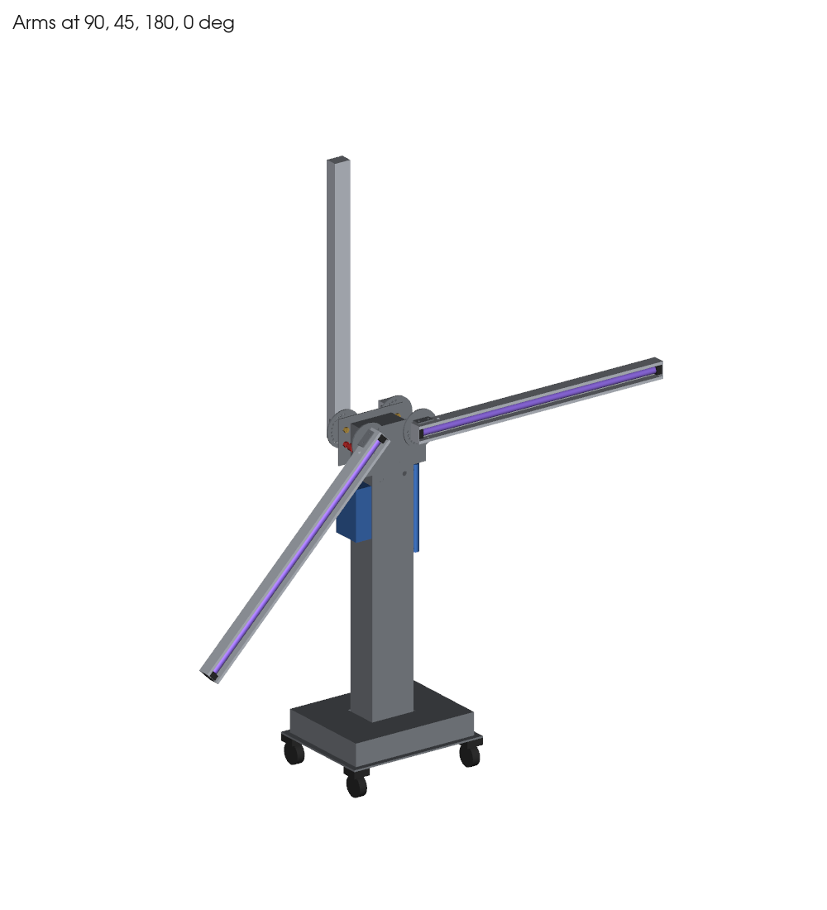
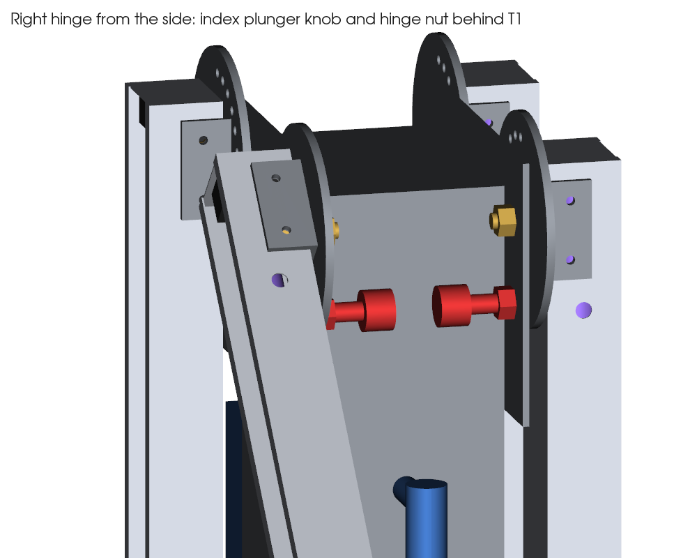
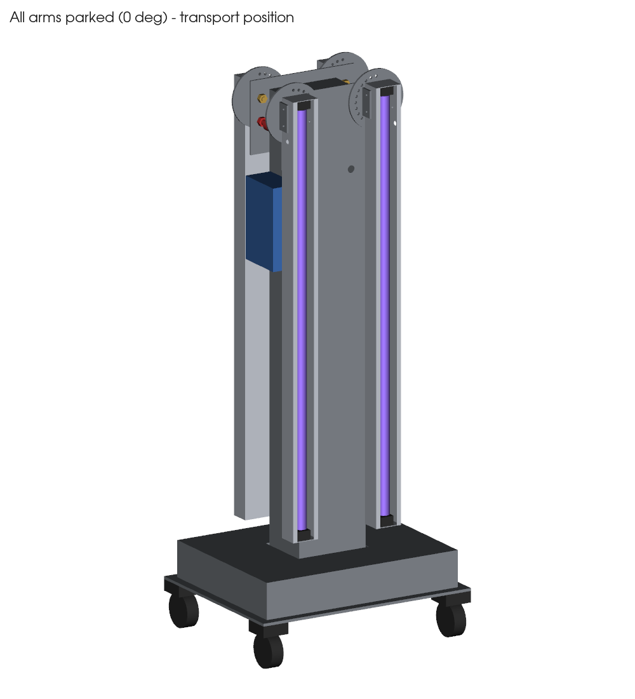
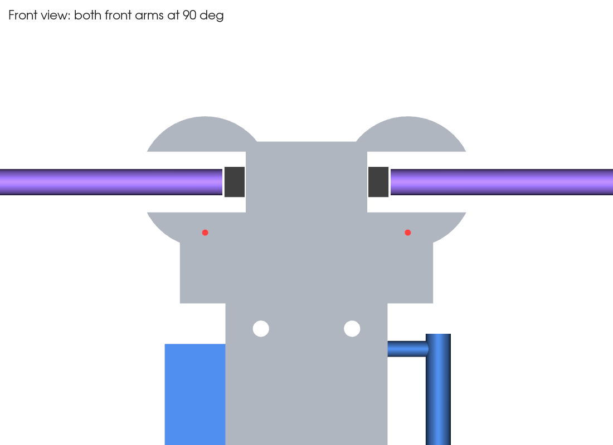

# پایه UV-C چهاربازو ۳۰ وات — طرح نهایی قطعات فلزی

**رایاطب** — شرکت دانش‌بنیان رایا طب هگمتانه نوین

مبنای کار نقشه «پایه UV-C چهاربازو ۳۰ وات» (۱۷ مهر ۱۴۰۵) است. همه قطعات فلزی سه‌بعدی و پارامتریک مدل شده‌اند. مونتاژ به‌صورت خودکار بررسی شد:
- تداخل حجمی بین همه قطعات، در هر ۱۳ زاویه هر بازو (۰ تا ۱۸۰ درجه، گام ۱۵)
- همه ۱۶۹ ترکیب زاویه بازوی چپ و راست روی یک وجه
- پایداری و وزن

**نتیجه: همه ۲۰ بررسی قبول شد.** هیچ قطعه‌ای به قطعه دیگر نمی‌خورد و همه پیچ‌ها و پین‌ها برای آچار و دست قابل دسترسی‌اند.



## مشخصات اصلی

| پارامتر | مقدار |
|---|---|
| ارتفاع محور لولا از کف | ۱۱۵۰ |
| ارتفاع کل، بازوها عمودی | ۲۰۶۰ |
| دهانه کل، بازوها افقی | ۲۰۲۰ |
| ارتفاع در حالت پارک | حدود ۱۲۱۵ |
| فاصله دو لولای هر وجه | ۲۰۰ (هر کدام ۱۰۰ از محور ستون) |
| زاویه بازو | ۰ تا ۱۸۰ درجه، ۱۳ موقعیت قفل (هر ۱۵ درجه) |
| وزن تخمینی کل | حدود ۳۸ کیلوگرم (سازه ۲۷، چهار بازو ۶٫۴، قطعات خریدنی ۵) |
| ضریب اطمینان واژگونی (دو بازوی یک طرف افقی) | حدود ۷٫۷ |

همه ابعاد به میلی‌متر است.

## لیست قطعات فلزی ساختنی

| کد | قطعه | تعداد | جنس | ابعاد اصلی | فایل لیزر |
|---|---|---|---|---|---|
| B1 | صفحه پایه | ۱ | فولاد ۶ | ۵۰۰ × ۴۰۰، ۴ سوراخ Ø۱۱ برای فلنج، ۱۶ سوراخ Ø۹ برای چرخ | `B1_base_plate_6mm.dxf` |
| B2 | جعبه باالست | ۱ | ورق ۱٫۵ | ۴۶۰ × ۳۶۰ × ۸۰، سوراخ ستون در سقف | — |
| C1 | بدنه ستون | ۱ | ورق ۱٫۵، دو U | ۱۶۰ × ۱۲۰ × ۱۰۵۰ | — |
| C1 | درپوش سر ستون | ۱ | فولاد ۴ | ۱۶۰ × ۱۲۰، جوشی | — |
| C1 | فلنج پای ستون | ۱ | فولاد ۶ | **۲۶۰ × ۲۲۰**، ۴ پیچ M10، ۲۵ از لبه | `C1_flange_6mm.dxf` |
| C1 | لچکی | ۴ | فولاد ۴ | مثلث **۵۰ (افقی) × ۶۰ (عمودی)**، وسط هر وجه | `C1_gusset_4mm_x4.dxf` |
| C2 | درب سرویس (پشت ستون) | ۱ | ورق ۱٫۲ | **۱۲۰ × ۶۰۰**، از ارتفاع ۳۰۰ | `C2_service_door_1.2mm.dxf` |
| C3 | جعبه پنل کنترل (وجه **چپ**) | ۱ | ورق ۱٫۲ | ۶۰ × ۱۱۰ × ۱۸۰، لبه بالا ۹۹۰ | — |
| — | دسته هل‌دادن (وجه **راست**) | ۱ | لوله Ø۲۵ | ۳۰۰ عمودی، بالای آن ۱۰۰۰ | — |
| T1 | صفحه سر (جلو و پشت) | ۲ | فولاد ۴ | **۲۵۰ × ۱۶۰**، ۲۸ بالاتر از سر ستون | `T1_head_plate_4mm_x2.dxf` |
| H1 | براکت U بازو | ۴ | فولاد ۴ | بلانک ۱۲۰ × ۶۰، کف ۶۸، ساق ۲۶ | `H1_bracket_blank_4mm_x4.dxf` |
| H2 | دیسک تقسیم | ۴ | فولاد ۵ | **Ø۱۳۰**، ۱۳ سوراخ Ø۶٫۲ روی **R۵۰** | `H2_index_disc_...dxf` |
| A1 | بدنه بازو (ناودانی رفلکتور) | ۴ | آلومینیوم ۱ | بلانک ۹۵۰ × ۱۷۰، خم ۱۰/۴۵/۶۰/۴۵/۱۰ | `A1_arm_blank_1mm_x4.dxf` |
| A2 | درپوش سر بازو | ۸ | آلومینیوم ۱ | ۵۸ × ۴۴ با لبه ۱۰ | `A2_end_cap_blank_1mm_x8.dxf` |
| A3 | گارد مفتولی لامپ | ۴ | مفتول استیل Ø۳ | ۵۰ × ۹۲۰ | — |

برای H1 و A1 قبل از برش، طول گسترده را با ضریب خم کارگاه خودتان چک کنید.

## قطعات خریدنی (یراق)

| قطعه | تعداد | مشخصات |
|---|---|---|
| پین فنری قفل (index plunger) H4 | ۴ | **M12×1.5، پین Ø۶، مدل با حالت استراحت** (lock-out، مثل GN 617.1 / GN 817.1) |
| مهره جوشی M12 | ۴ | پشت T1، زیر هر لولا |
| پیچ محور H3 | ۴ | **ISO 7380 M10×30** (سرگرد، سر داخل ناودانی) |
| بوش برنجی فلنج‌دار | ۴ | Ø۱۰/Ø۱۴، طول ۱۰ |
| مهره M10 نایلون‌دار + واشر | ۴ | پشت T1، از کنار ستون در دسترس است |
| واشر تفلونی | ۴ | Ø۳۰/Ø۱۴ × ۱ |
| پیچ خزینه M8 + پرچ‌مهره M8 | ۱۲ | ۶ عدد برای هر T1 (۴ پایین، ۲ بالا) |
| پیچ سرگرد M5 + مهره | ۱۶ | ۴ عدد برای هر براکت H1، از دیواره کناری ناودانی |
| پیچ M10 + مهره | ۴ | فلنج ستون به صفحه پایه |
| گرومت Ø۱۶ | ۲ | ورود کابل‌ها به ستون، زیر T1 جلو و پشت |
| گرومت فلزی Ø۱۰ | ۴ | خروج کابل از دیواره کناری بازو، ۹۰ از سر |
| چرخ گردان Ø۷۵ | ۴ | روکش PU، دو عدد ترمزدار در یک قطر، ارتفاع حدود ۱۰۰ |
| لامپ UV-C T8 30W + سرپیچ G13 | ۴ + ۸ | فاصله سرپیچ‌ها ۹۰۸ |

## پین فنری قفل چطور کار می‌کند



- پین فنری (قرمز در تصویر) پشت T1 داخل مهره جوشی M12 بسته می‌شود.
- داخل پین یک فنر هست که پین Ø۶ را همیشه به جلو هل می‌دهد.
- دیسک H2 به بازو جوش شده و با آن می‌چرخد. روی دیسک ۱۳ سوراخ هست، هر ۱۵ درجه یکی.
- وقتی پین داخل یکی از سوراخ‌ها باشد، بازو قفل است.

برای تغییر زاویه:
1. دسته را بکشید و یک ربع بچرخانید. پین بیرون می‌ماند (حالت استراحت).
2. بازو را با دو دست به زاویه دلخواه ببرید.
3. دسته را برگردانید. فنر پین را در سوراخ می‌اندازد.

بار روی پین حدود ۱۲۰ نیوتن است و پین Ø۶ چند برابر آن را تحمل می‌کند. سوراخ‌های دیسک را Ø۵٫۸ لیزر کنید و با برقو Ø۶ H8 کنید تا بازو لق نباشد.

## نکات طراحی که با نقشه PDF فرق دارد

| مورد | در PDF | طرح نهایی | دلیل |
|---|---|---|---|
| فاصله لولاها | ۱۴۰ | ۲۰۰ | مهره محور و دسته پین بیرون از ستون می‌افتند و دست و آچار به آن‌ها می‌رسد |
| محل محور در بازو | ۸۰ از سر | ۴۰ از سر | با ۸۰، سر دو بازوی یک وجه در حالت افقی به هم می‌خورد |
| دیسک تقسیم | Ø۱۱۰ / R۴۰ | Ø۱۳۰ / R۵۰ | پین به براکت نمی‌خورد و دیواره بین سوراخ‌ها محکم‌تر است |
| پین فنری | M8 با پین Ø۶ | M12×1.5 با پین Ø۶ | پین Ø۶ استاندارد روی رزوه M12 است |
| پیچ محور | M10×60 | M10×30 سرگرد | ۶۰ میلی‌متر یا در ستون فرو می‌رفت یا به لامپ می‌خورد |
| فلنج ستون | ۲۰۰ × ۱۶۰ | ۲۶۰ × ۲۲۰ | جای لچکی و آچار نبود |
| لچکی | ۱۰۰ × ۱۰۰ | ۵۰ × ۶۰ | روی فلنج و زیر سقف جعبه باالست جا می‌شود |
| پنل و دسته | وجه جلو | پنل وجه چپ، دسته وجه راست | روی وجه جلو با T1 و بازوها تداخل داشتند |
| T1 | ۲۲۰ × ۱۶۰، ۴ پیچ | ۲۵۰ × ۱۶۰، ۶ پیچ خزینه | محور دقیقاً ۱۱۵۰ است و پیچ‌ها به دیسک نمی‌خورند |

## نتیجه بررسی‌ها

| کد | بررسی | نتیجه |
|---|---|---|
| SW-1 | بازوها در ۱۳ زاویه با ستون، T1، پنل، دسته و پایه | بدون تماس |
| SW-2 | بازوی چپ و راست یک وجه، ۱۶۹ ترکیب | بدون برخورد (شعاع سر کوتاه ۶۵ < ۱۰۰) |
| H4-1 / H4-2 | دسترسی به دسته پین و جا افتادن پین در هر ۱۳ موقعیت | فاصله دسته تا ستون ۷٫۵، جا افتادن کامل |
| H3-1 / H3-2 | پیچ محور، مهره و لامپ | مهره ۱۰ از ستون فاصله دارد، سر پیچ ۳٫۵ تا لامپ |
| C1-1..3 | فلنج، لچکی، جای آچار بکس Ø۲۸ | قبول |
| C3-1 / C2-1 | پنل، درب سرویس و سوراخ کابل در برابر بازوهای پارک | قبول |
| A1-1 | نوک بازوی پارک تا سقف جعبه باالست | ۵۴ (حداقل لازم ۵۰) |
| ST-1 / ST-2 | پایداری | ضریب ۷٫۷؛ با بازوهای عمودی حدود ۴ کیلوگرم‌نیرو هل از بالا دستگاه را می‌اندازد. فقط با بازوهای پارک جابه‌جا شود |

جزئیات کامل در `results/checks.json` است.

| بازوها پارک (حمل) | دو بازوی جلو افقی |
|---|---|
|  |  |

## ترتیب مونتاژ

1. لامپ و سرپیچ واقعی را بخرید. فاصله ۹۰۸ را با آن‌ها چک کنید و بعد ورق بازو را برش بزنید.
2. یک بازو و یک لولا را اول به‌عنوان نمونه بسازید و قفل ۱۳ موقعیت را تست کنید.
3. ستون، فلنج و لچکی‌ها را جوش بدهید. پرچ‌مهره‌های M8 را بزنید و رنگ پودری کنید.
4. صفحه پایه، چرخ‌ها و ستون را ببندید. بعد باالست‌ها و جعبه B2 را نصب کنید.
5. مهره‌های جوشی M12 را پشت T1 جوش بدهید، پین‌ها را ببندید و T1 را روی ستون پیچ کنید.
6. بازوها را با بوش برنجی، واشر تفلونی و مهره نایلون‌دار نصب کنید. چرخش باید روان و بدون لقی باشد.
7. سیم‌کشی را انجام دهید: کابل سیلیکونی، حلقه آزاد حدود ۱۵۰ کنار هر لولا، و ارت ستون، پایه و هر بازو. بعد تست عایقی، تأخیر شروع، قطع با PIR و استاپ اضطراری را انجام دهید.
8. تست پایداری و اندازه‌گیری شدت تابش در فاصله ۱ متر را انجام دهید.

## فایل‌ها

| مسیر | محتوا |
|---|---|
| `step/UVC_stand_assembly.step` | مونتاژ کامل با نام و رنگ قطعات. در SolidWorks: File → Open |
| `step/parts/*.step` | قطعات جدا |
| `dxf/*.dxf` | پروفیل برش لیزر |
| `video/UV-C_stand_Rayateb_vertical.mp4` | کلیپ عمودی مونتاژ و حرکت بازوها |
| `images/*.png` | تصاویر |
| `cad/model.py` | مدل پارامتریک. همه ابعاد در `Cfg` هستند |
| `cad/checks.py` | بررسی تداخل، دسترسی، پایداری و وزن |
| `cad/export.py`، `cad/video.py` | ساخت STEP، DXF، تصاویر و کلیپ |

ساخت دوباره بعد از تغییر ابعاد:
```bash
pip install -r cad/requirements.txt      # Linux headless: apt install libosmesa6
cd cad && python checks.py && python export.py && python video.py
```

## فرض‌ها (قبل از برش با قطعه واقعی چک شود)

- **ارتفاع چرخ با صفحه نصب: ۱۰۰.** اگر کمتر باشد، فاصله نوک بازو تا B2 (۵۴) کم می‌شود. در این صورت `caster_h` را عوض کنید و `checks.py` را دوباره اجرا کنید.
- **فاصله سرپیچ‌ها ۹۰۸** با لامپ T8 به قطر ۲۶ فرض شده است.
- **ابعاد پین فنری** تقریبی است (دسته Ø۲۵، طول کل پشت T1 حدود ۴۶). مدل خریداری‌شده را چک کنید.
- **الگوی سوراخ چرخ ۴۵ × ۴۵** فرض شده است. با چرخ واقعی تطبیق دهید.
